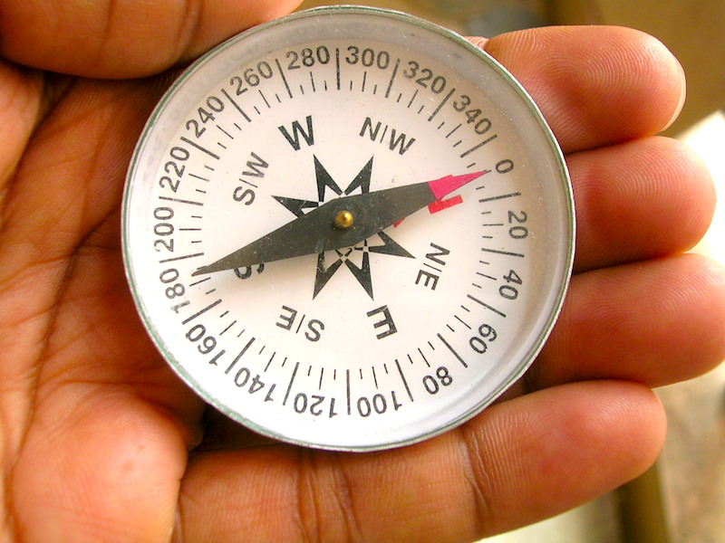

    

## Contributors
Christian L, Kawika N, Lenox C, Gunnar L, Ryan T

## Overview

### The Problem
31% of students at UH Manoa are out of state, with 8% being international. For many of these students, it is their first time in Hawaii, and they have no idea what there is to do around campus and in the state itself. Simply searching for things on Google Maps can take time and often leads to minimal activity suggestions. This results in students feeling isolated and stressed due to a lack of things to do.

### The Solution
Manoa Compass is a web application that UH Manoa students can log into using their school email. Each student can create a profile that includes their interests, major, hometown, housing details, and transportation options. Using AI, the system will generate a personalized To-Do list to help students discover their favorite spots on the island and engage in activities during their time at UH Manoa.

---

## Mockup Page Ideas

- **Landing Page:** Welcomes visitors and prompts them to log in or sign up with their UH Manoa email.
- **User Profile Page:** Allows users to input their interests, major, hometown, housing details, and transportation options.
- **To-Do List Page:** Displays a dynamic, AI-generated list of recommended activities and locations.
- **(Optional) Explore/Map Page:** Interactive map showcasing recommended spots, with filters based on categories (e.g., food, outdoor, cultural).

---

## Use Case Ideas

### New User Registration
1. User lands on the Landing Page and logs in with their UH Manoa email.
2. After logging in, the user is taken to the User Profile Page to enter personal details (interests, major, hometown, etc.).
3. The system confirms the profile setup and informs the user that an AI-driven process will generate a personalized to-do list.

### Receiving Personalized Recommendations
4. After profile completion, the user is redirected to the To-Do List Page, where they see a curated list of activities and destinations around campus and across the island.
5. The user can click on each recommendation for more details, including location, suggested visit time, and special notes.

### Interaction and Feedback
6. After visiting a location or trying an activity, the user can leave feedback or rate the experience.
7. This feedback helps refine future recommendations for the user and others with similar interests.

---

## Beyond the Basics

### Advanced Notification System
- **Real-Time Alerts:** Send notifications (via email, SMS, or in-app) when new recommendations or nearby events match the user’s profile.
- **Calendar Integration:** Allow users to add recommended events or activities to their digital calendars (e.g., Google Calendar).

### Social and Community Features
- **Sharing and Collaboration:** Enable users to share their to-do lists or favorite spots with friends and classmates.
- **Community Reviews:** Allow users to post reviews or comments on recommended activities to provide insights for peers.

### Enhanced Personalization
- **Dynamic Updates:** Continuously update recommendations based on user behavior (e.g., frequently visited or highly rated activities).
- **Interactive Map Integration:** Provide an interactive map view with locations, directions, and contextual information about each spot.

### Administrative and Analytics Tools
- **User Analytics:** Allow administrators to monitor user engagement and identify trends in activity preferences.
- **Content Management:** Enable admins to update and curate activities or campus events to keep recommendations relevant and timely.

---

By combining AI-driven personalization with community feedback and robust integration features, **Manoa Compass** aims to transform how students explore their new home, making campus life more engaging and connected from day one.

