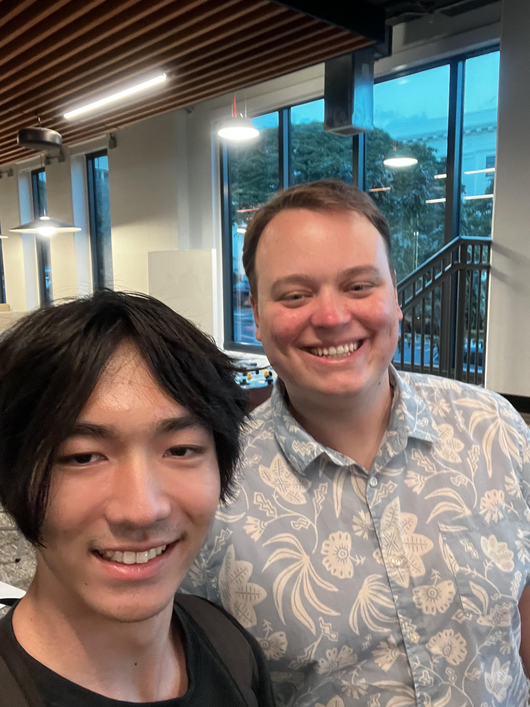

    

## Intro 

  Attending the PACE Tech Networking event was an eye-opening experience that provided valuable insights into the world of technology careers and innovation. As a student interested in the intersection of software development, UX design, and startup culture, this event allowed me to engage with industry professionals, collaborate with peers, and refine my understanding of potential career paths in tech.

Upon arriving at the event, I was immediately struck by the interesting atmosphere filled with students and professionals eager to connect. Throughout the evening, I had the opportunity to meet over 40 professionals working in various tech fields, including software engineering, UX/UI design, cybersecurity, and mobile app development. I spoke with several professionals from different backgrounds, each of whom shared unique perspectives on the industry. One particularly insightful conversation was with a UX designer who emphasized the importance of user-centric design and how it plays a crucial role in the success of digital products. Additionally, I had an engaging discussion with a software engineer specializing in artificial intelligence, who provided guidance on the growing demand for AI-related skills in today’s job market.

## My Experience

  The event also featured a segment where students could pitch their ideas in the hopes of forming startup partnerships. While I did not participate in pitching, I listened to several presentations, gaining insight into innovative ideas and how students effectively communicated their concepts. Observing this process helped me understand the importance of clear articulation and the ability to capture interest from potential collaborators and investors.

Beyond networking and pitching, I learned valuable lessons about career development in the tech industry. Many professionals emphasized the importance of continuously learning new technologies, building a strong portfolio, and gaining hands-on experience through internships and personal projects. I also gained insight into the different paths one could take in tech, whether through joining established companies, freelancing, or launching a startup.

## Conlusion 
  Overall, the PACE Tech Networking event was a great experience that broadened my perspective on the tech industry. The connections I made, the feedback I received, and the knowledge I gained have further motivated me to pursue my career aspirations in technology. 
