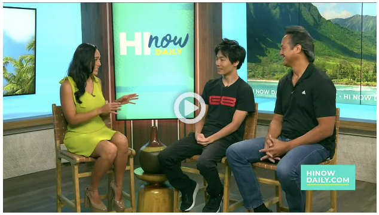

    

In September 2023, I had the opportunity to speak on Hawaii News Now, where I discussed the pressing issues surrounding disabilities in technology, with a focus on the esports and tech industries. The segment provided a platform to raise awareness about the challenges individuals with disabilities face when navigating these spaces. I highlighted how current technology often overlooks the needs of disabled individuals and emphasized the importance of creating more inclusive solutions. By sharing personal insights and professional perspectives, I aimed to spark a conversation about the need for better accessibility and design in the world of esports, technology, and gaming.

The appearance served as an important moment in advocating for inclusivity, where I discussed not only the barriers but also the tremendous opportunities for growth in the esports and tech through accessibility. I stressed the potential for companies to expand their audiences. My goal was to encourage both companies and individuals within the industry to recognize the value of inclusivity and to promote a more equitable environment where everyone can participate, and enjoy themselves in the esports and tech communities.

    
Check out my appearance on Hawaii News Now discussing inclusivity in esports and technology:

    <a href="https://www.hawaiinewsnow.com/video/2023/09/12/university-hawaii-esports-creates-space-that-welcomes-diversity-students/" target="_blank">
        Hawaii News Now - University of Hawaii Esports Creates Space That Welcomes Diversity
    </a>

