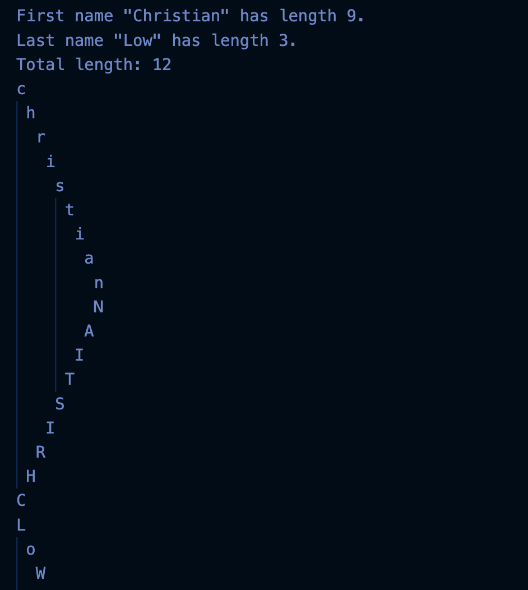

    
  

Working on this assignment significantly improved my understanding of C, particularly in string manipulation and memory handling. Through this project, I learned how to declare and initialize character arrays and pointers to store strings efficiently. Calculating the lengths of my first and last names using strlen() reinforced my knowledge of how strings are stored and accessed in memory.  The staircase and reverse staircase output formatting provided me with valuable practice in nested loops, demonstrating how to manipulate text output effectively. Working with functions such as tolower() and toupper() from ctype.h showed me how to perform character-wise transformations in an efficient and readable manner.

This assignment also strengthened my debugging and problem-solving skills. Initially, I encountered issues with pointer usage when trying to modify string literals, which helped me understand the distinction between mutable character arrays and immutable string literals. Additionally, formatting the staircase outputs required careful attention to loop structure and whitespace management, reinforcing my understanding of iteration logic. The toggle-case staircase for the last name was particularly interesting, as it challenged me to apply conditional logic within loops to modify output dynamically. By completing this task, I gained confidence in handling character arrays, pointer manipulation, and structured output formatting, all of which are essential for more advanced programming in C.

<a href="https://github.com/christianlow428/Portfolio/blob/main/Staircase.c" target="_blank">View Staircase.c</a>

